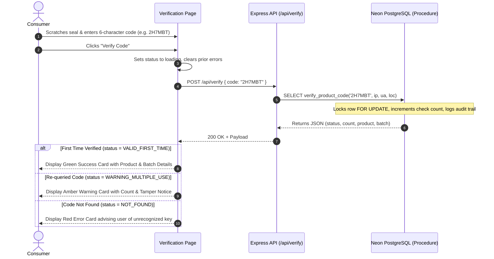
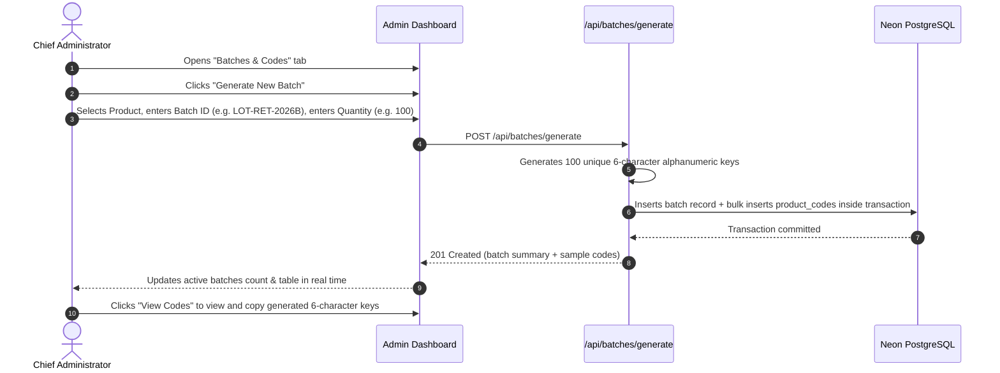

# Application Flow & User Journeys (APP_FLOW)

> Status: Approved • Version 1.0.0

## 🧭 1. System Entry Points

| Entry Point | Target Destination | Context |
|---|---|---|
| **Root URL (`/`)** | Home Landing Page | Public entrance showcasing scientific philosophy, hero presentation, and quick links. |
| **Direct Verification (`/autenticacao`)** | Authenticity Validator | Direct destination for consumers who scanned QR code on packaging or clicked "Verify". |
| **Catalog (`/produtos`)** | Products Catalog | Complete compound list with purity levels, formulas, and presentations. |
| **Corporate Info (`/sobre`)** | About Us | Company scientific vision, research pillars, and quality standards. |
| **Contact Form (`/contato`)** | Contact & Inquiries | Corporate inquiries, authenticity support, and commercial partnerships. |
| **Admin Portal (`/admin/dashboard`)** | Operations Center | Authorized management of batches, codes, catalog, and fraud telemetry. |

---

## 👥 2. Primary Journey: End-Consumer Product Verification

---

## 🌐 3. Language Switching Flow (English / Spanish)

1. **Default State:** Application renders in English (`en`).
2. **User Action:** User clicks language toggle in the navigation bar (`EN` or `ES`).
3. **Internal State Update:** `i18n.changeLanguage(lng)` triggers re-render of all bound components.
4. **Zero-Portuguese Guarantee:**
   - Nav bar, footer, and buttons switch immediately.
   - Compound catalog displays scientific specifications.
   - Verification responses automatically render in the selected language.

---

## ⚙️ 4. Secondary Journey: Administrator Batch Generation

---

## 🛑 5. Edge Cases & Fallback States

- **Network Offline / Disconnection:** If the Neon database or API is unreachable, the client falls back to client-side verification presets (`2H7MBT` and `USED02`) with an alert notification.
- **Ambiguous Characters:** Characters `0`, `O`, `1`, `I` are excluded from code generation to eliminate typographical user errors on scratch labels.
- **Empty / Malformed Inputs:** Client prevents submission if trimmed code is empty; input field is automatically transformed to uppercase in real time.
