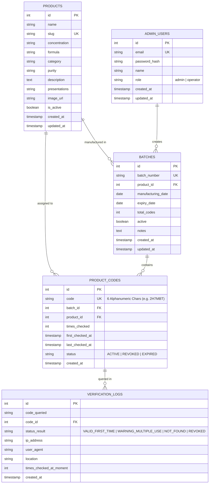

# Database Architecture & Schema Specification

> Status: Approved • Neon Cloud PostgreSQL 18
> Target Project: `Farmacia_essence` (AWS sa-east-1 / São Paulo)

## 🎯 1. Overview & Objectives

The Essence Pharma data tier is powered by **Neon Serverless PostgreSQL 18**, offering autoscaling compute, branching, and point-in-time recovery. The schema is engineered specifically for ultra-low latency cryptographic authentication, tamper prevention, and real-time fraud telemetry.

---

## 🗃️ 2. Entity Relational Model



---

## 🧱 3. Table Definitions & Constraints

### 3.1 `products`
Stores pharmaceutical compound catalog specifications.

```sql
CREATE TABLE IF NOT EXISTS products (
    id SERIAL PRIMARY KEY,
    name VARCHAR(100) NOT NULL,
    slug VARCHAR(120) NOT NULL UNIQUE,
    concentration VARCHAR(50),
    formula VARCHAR(50),
    category VARCHAR(50) DEFAULT 'Peptides',
    purity VARCHAR(30) DEFAULT '≥ 99.0% HPLC',
    description TEXT,
    presentations VARCHAR(255),
    image_url TEXT,
    is_active BOOLEAN DEFAULT true,
    created_at TIMESTAMPTZ DEFAULT CURRENT_TIMESTAMP,
    updated_at TIMESTAMPTZ DEFAULT CURRENT_TIMESTAMP
);
```

### 3.2 `batches`
Stores production batches associated with each product.

```sql
CREATE TABLE IF NOT EXISTS batches (
    id SERIAL PRIMARY KEY,
    batch_number VARCHAR(50) NOT NULL UNIQUE,
    product_id INT NOT NULL REFERENCES products(id) ON DELETE RESTRICT,
    manufacturing_date DATE NOT NULL DEFAULT CURRENT_DATE,
    expiry_date DATE NOT NULL DEFAULT (CURRENT_DATE + INTERVAL '2 years'),
    total_codes INT NOT NULL DEFAULT 0,
    active BOOLEAN DEFAULT true,
    notes TEXT,
    created_at TIMESTAMPTZ DEFAULT CURRENT_TIMESTAMP,
    updated_at TIMESTAMPTZ DEFAULT CURRENT_TIMESTAMP
);
```

### 3.3 `product_codes`
Stores unique 6-character alphanumeric verification codes generated for each unit.

```sql
CREATE TABLE IF NOT EXISTS product_codes (
    id SERIAL PRIMARY KEY,
    code VARCHAR(6) NOT NULL UNIQUE,
    batch_id INT NOT NULL REFERENCES batches(id) ON DELETE CASCADE,
    product_id INT NOT NULL REFERENCES products(id) ON DELETE RESTRICT,
    times_checked INT NOT NULL DEFAULT 0,
    first_checked_at TIMESTAMPTZ,
    last_checked_at TIMESTAMPTZ,
    status VARCHAR(20) NOT NULL DEFAULT 'ACTIVE' CHECK (status IN ('ACTIVE', 'REVOKED', 'EXPIRED')),
    created_at TIMESTAMPTZ DEFAULT CURRENT_TIMESTAMP
);
```

### 3.4 `verification_logs`
High-volume audit table logging every verification query (including failed and repeated attempts).

```sql
CREATE TABLE IF NOT EXISTS verification_logs (
    id SERIAL PRIMARY KEY,
    code_queried VARCHAR(50) NOT NULL,
    code_id INT REFERENCES product_codes(id) ON DELETE SET NULL,
    status_result VARCHAR(30) NOT NULL,
    ip_address VARCHAR(45),
    user_agent TEXT,
    location VARCHAR(100),
    times_checked_at_moment INT NOT NULL DEFAULT 0,
    created_at TIMESTAMPTZ DEFAULT CURRENT_TIMESTAMP
);
```

### 3.5 `admin_users`
Authorized administrative accounts for dashboard management.

```sql
CREATE TABLE IF NOT EXISTS admin_users (
    id SERIAL PRIMARY KEY,
    email VARCHAR(150) NOT NULL UNIQUE,
    password_hash VARCHAR(255) NOT NULL,
    name VARCHAR(100) NOT NULL,
    role VARCHAR(30) NOT NULL DEFAULT 'admin',
    created_at TIMESTAMPTZ DEFAULT CURRENT_TIMESTAMP,
    updated_at TIMESTAMPTZ DEFAULT CURRENT_TIMESTAMP
);
```

---

## ⚡ 4. Stored Procedure: Atomic Verification (`verify_product_code`)

To guarantee strict isolation and eliminate race conditions when duplicate checks arrive simultaneously, verification is executed inside an atomic PostgreSQL PL/pgSQL function with row-level locking:

```sql
CREATE OR REPLACE FUNCTION verify_product_code(
    p_code VARCHAR,
    p_ip VARCHAR,
    p_user_agent VARCHAR,
    p_location VARCHAR DEFAULT 'Global'
)
RETURNS JSONB
LANGUAGE plpgsql
AS $$
DECLARE
    v_clean_code VARCHAR;
    v_code_id INT;
    v_batch_id INT;
    v_product_id INT;
    v_times_checked INT;
    v_first_checked_at TIMESTAMPTZ;
    v_last_checked_at TIMESTAMPTZ;
    v_code_status VARCHAR;
    v_status_result VARCHAR;
    v_msg TEXT;
    v_product JSONB;
    v_batch JSONB;
BEGIN
    v_clean_code := UPPER(TRIM(p_code));

    -- Lock row for concurrency safety (prevents concurrent double-spend/re-check attacks)
    SELECT id, batch_id, product_id, times_checked, first_checked_at, last_checked_at, status
    INTO v_code_id, v_batch_id, v_product_id, v_times_checked, v_first_checked_at, v_last_checked_at, v_code_status
    FROM product_codes
    WHERE code = v_clean_code
    FOR UPDATE;

    IF NOT FOUND THEN
        -- Log attempt as not found
        INSERT INTO verification_logs (code_queried, code_id, status_result, ip_address, user_agent, location, times_checked_at_moment)
        VALUES (v_clean_code, NULL, 'NOT_FOUND', p_ip, p_user_agent, p_location, 0);

        RETURN jsonb_build_object(
            'success', false,
            'status', 'NOT_FOUND',
            'code', v_clean_code,
            'message', 'Security code not found in our official registry.'
        );
    END IF;

    -- Update counters
    v_times_checked := v_times_checked + 1;
    IF v_first_checked_at IS NULL THEN
        v_first_checked_at := NOW();
    END IF;
    v_last_checked_at := NOW();

    UPDATE product_codes
    SET times_checked = v_times_checked,
        first_checked_at = v_first_checked_at,
        last_checked_at = v_last_checked_at
    WHERE id = v_code_id;

    -- Determine status result
    IF v_code_status != 'ACTIVE' THEN
        v_status_result := 'REVOKED';
        v_msg := 'Warning: This batch or security code has been revoked for security reasons.';
    ELSIF v_times_checked = 1 THEN
        v_status_result := 'VALID_FIRST_TIME';
        v_msg := 'Authentic: First verification completed successfully.';
    ELSE
        v_status_result := 'WARNING_MULTIPLE_USE';
        v_msg := format('Warning: This security code has already been verified %s times previously.', v_times_checked);
    END IF;

    -- Record audit log
    INSERT INTO verification_logs (code_queried, code_id, status_result, ip_address, user_agent, location, times_checked_at_moment)
    VALUES (v_clean_code, v_code_id, v_status_result, p_ip, p_user_agent, p_location, v_times_checked);

    -- Load product info
    SELECT to_jsonb(p) INTO v_product FROM (
        SELECT id, name, slug, concentration, formula, category, purity, description, presentations, image_url
        FROM products WHERE id = v_product_id
    ) p;

    -- Load batch info
    SELECT to_jsonb(b) INTO v_batch FROM (
        SELECT id, batch_number, manufacturing_date, expiry_date, active
        FROM batches WHERE id = v_batch_id
    ) b;

    RETURN jsonb_build_object(
        'success', (v_status_result != 'REVOKED'),
        'status', v_status_result,
        'code', v_clean_code,
        'message', v_msg,
        'times_checked', v_times_checked,
        'first_checked_at', v_first_checked_at,
        'last_checked_at', v_last_checked_at,
        'product', v_product,
        'batch', v_batch
    );
END;
$$;
```

---

## 🚀 5. Performance Indexing

```sql
-- Fast case-insensitive code search
CREATE UNIQUE INDEX IF NOT EXISTS idx_product_codes_code ON product_codes(code);

-- Foreign key lookup optimization
CREATE INDEX IF NOT EXISTS idx_product_codes_batch_id ON product_codes(batch_id);
CREATE INDEX IF NOT EXISTS idx_product_codes_product_id ON product_codes(product_id);

-- Real-time telemetry query indexing
CREATE INDEX IF NOT EXISTS idx_verification_logs_created_at ON verification_logs(created_at DESC);
CREATE INDEX IF NOT EXISTS idx_verification_logs_status_result ON verification_logs(status_result);
CREATE INDEX IF NOT EXISTS idx_verification_logs_code_queried ON verification_logs(code_queried);
```

---

## 🔐 6. Connection Management & Security

1. **SSL Mode:** All connections require `sslmode=require` with TLS encryption in transit.
2. **Pooling:** Server uses `pg.Pool` with connection reuse:
   - `max: 20` clients in pool
   - `idleTimeoutMillis: 30000`
   - `connectionTimeoutMillis: 5000`
3. **Credentials:** Never committed to source code; managed via `.env` and Vercel environment variables (`DATABASE_URL`).
